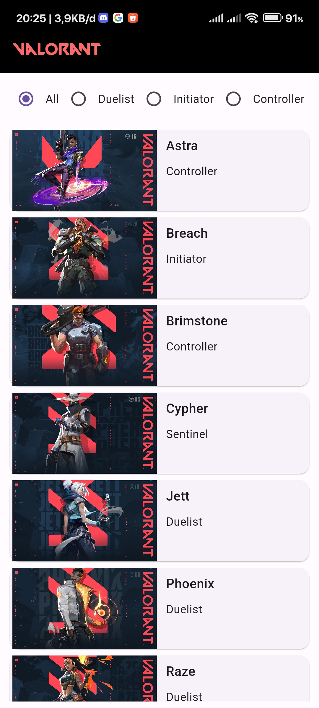
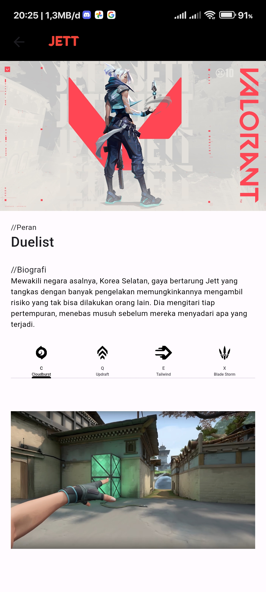

# Valorant App

Valorant App is a mobile application designed to provide information about Valorant agents. This app allows users to explore various agents, their roles, and skills in the popular tactical shooter game Valorant.

## Features

- **Agent List**: View a list of Valorant agents along with their respective images.
- **Filter by Role**: Use radio buttons to filter the agent list based on roles such as Duelist, Initiator, Controller, and Sentinel.
- **Agent Details**: Access detailed information about each agent, including their image and description.
- **Skill Videos**: Explore the skills of each agent through skill demonstration videos in the tab bar.

## Screenshots

<div style="display: flex;">
  
  
</div>


## Technologies Used

- **Flutter**: The app is built using the Flutter framework for cross-platform mobile development.
- **Dart**: The programming language used for coding the application logic.
- **GitHub**: The repository is hosted on GitHub for version control and collaboration.

## Installation

1. Clone the repository:
   ```
   git clone https://github.com/your-username/valorant-app.git
   ```

2. Navigate to the project directory:
   ```
   cd valorant-app
   ```

3. Install dependencies:
   ```
   flutter pub get
   ```

4. Run the app:
   ```
   flutter run
   ```

## Contributions

Contributions are welcome! If you want to contribute to Valorant App, feel free to submit a pull request. Please make sure to follow the contribution guidelines.

## Acknowledgements

Special thanks to [Riot Games](https://riotgames.com/) for creating the [Valorant game](https://playvalorant.com/) and providing the necessary resources for developers to build applications like Valorant App.
